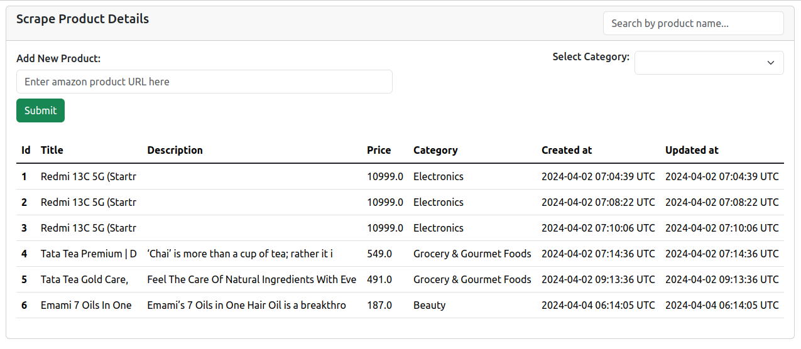

## About
    This is a project to scrape product details from Amazon.

#### Features

    - Implemented functionality to scrape product details from a given URL from Amazon
    - Implemented background job to refetch and update product data if it is older than one week using Sidekiq
    - Implemented feature to filter product category wise
    - Implemented search feature that triggers a request after a brief pause in typing in search field

#### Prerequisites

- ruby 3.2.2
- rails 7.0.8
- Node 18+, and Yarn 1.x

#### Install

##### 1. Check out the repository

```bash
git clone https://github.com/ravendra-01/scrape_amazon_product_info.git
```

##### 2. Create and setup the database

Run the following commands to install gems.

```ruby
bundle install
```

##### 3. Create and setup the database

Run the following commands to create and setup the database.

```ruby
rails db:create db:migrate db:seed
```

##### 4. Start the Rails server

You can start the rails server using the command given below.

```ruby
rails s
```

And now you can visit the site with the URL http://localhost:3000

- Screenshots


